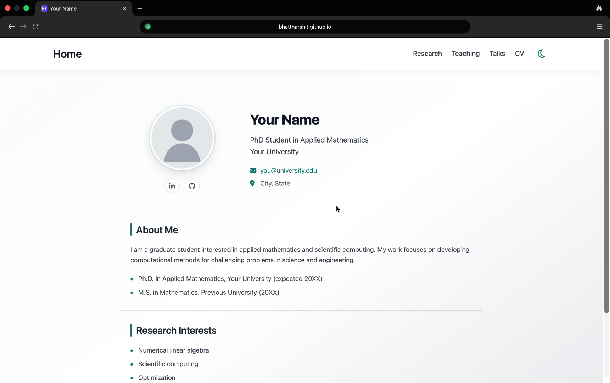

# Academic Starter

A simple Hugo template for creating and maintaining a professional academic website.

<p align="center">
  <a href="https://bhattharshit.github.io/academic-starter/">
    
  </a>
</p>

<p align="center">
  <a href="https://bhattharshit.github.io/academic-starter/">
    <strong>View Live Demo →</strong>
  </a>
</p>

## Quick Start

1. Click **Use this template → Create a new repository**.
2. Go to **Settings → Pages** and set **Source** to **GitHub Actions**.
3. Edit `data/profile.toml` with your information.
4. Replace the profile image and `static/files/cv.pdf`.
5. Edit the Research, Teaching, and Talks pages as needed.
6. Commit your changes to `main`.

GitHub Actions will automatically build and publish the site.

## Site Information

Most site-wide information is controlled from:

```text
data/profile.toml
```

This includes your:

- name and academic title
- institution and contact information
- biography and education
- research interests
- profile image
- CV
- LinkedIn, Google Scholar, ORCID, and GitHub links

## Profile Image

Place your image in:

```text
static/images/
```

and update its path in `data/profile.toml`, for example:

```toml
avatar = "images/profile.jpg"
```

## CV

Replace:

```text
static/files/cv.pdf
```

with your own CV.

If you use a different filename, update its path in `data/profile.toml`:

```toml
cv = "files/my-cv.pdf"
```

The **CV** tab opens the PDF directly.

## Edit Existing Pages

The starter includes:

```text
content/research/_index.md
content/teaching/_index.md
content/talks/_index.md
```

Replace the example content with your own.

## Add a Navigation Tab

Navigation is generated automatically.

For example, to add a **Projects** page, create:

```text
content/projects/_index.md
```

with:

```yaml
---
title: "Projects"
draft: false
menu: true
weight: 25
---

Add your project information here.
```

Lower `weight` values appear earlier in the navigation bar.

The default order is:

```text
Research   10
Teaching   15
Talks      20
```

Set `menu: false` if you want the page to exist without appearing in the navigation bar.

## Run Locally (optional)

Install [Hugo](https://gohugo.io/), then run:

```bash
hugo server
```

On macOS, Hugo can be installed with:

```bash
brew install hugo
```

Open the local address shown in the terminal.

## Repository Structure

```text
data/profile.toml         # Personal and site-wide information

content/
├── research/             # Research page
├── teaching/             # Teaching page
└── talks/                # Talks page

static/
├── images/               # Profile image and other images
├── files/cv.pdf          # CV
└── css/                  # Site styling

layouts/                  # Hugo templates
.github/workflows/        # GitHub Pages deployment
hugo.toml                 # Hugo configuration
```

For normal use, you generally only need to edit `data/profile.toml`, files under `content/`, and your image/CV files.

## Troubleshooting

If GitHub Actions reports:

```text
Get Pages site failed
```

go to:

**Settings → Pages → Build and deployment → Source → GitHub Actions**

Then re-run the failed workflow from the **Actions** tab.

## Acknowledgment

This template is built with [Hugo](https://gohugo.io/) by [Harshit Bhatt](https://bhattharshit.github.io/).
